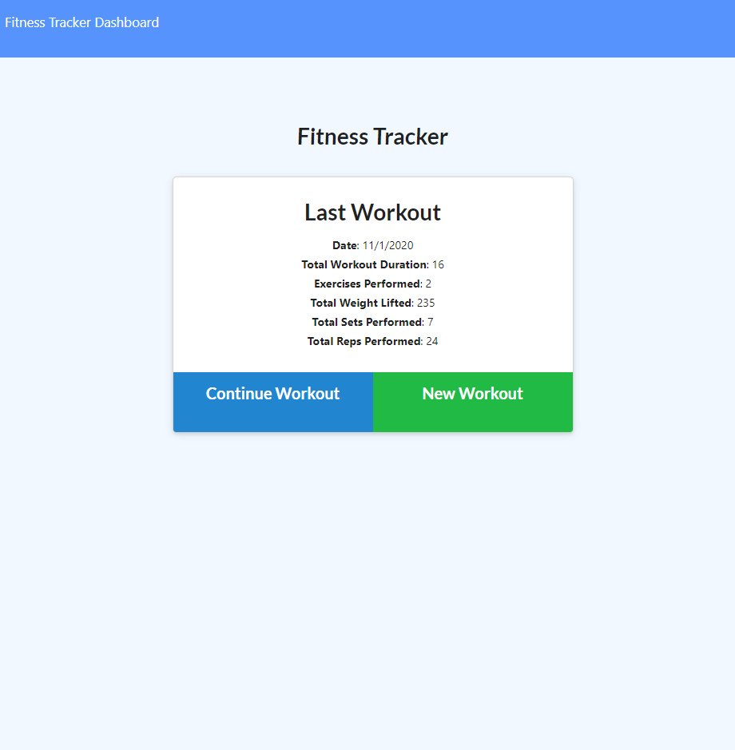
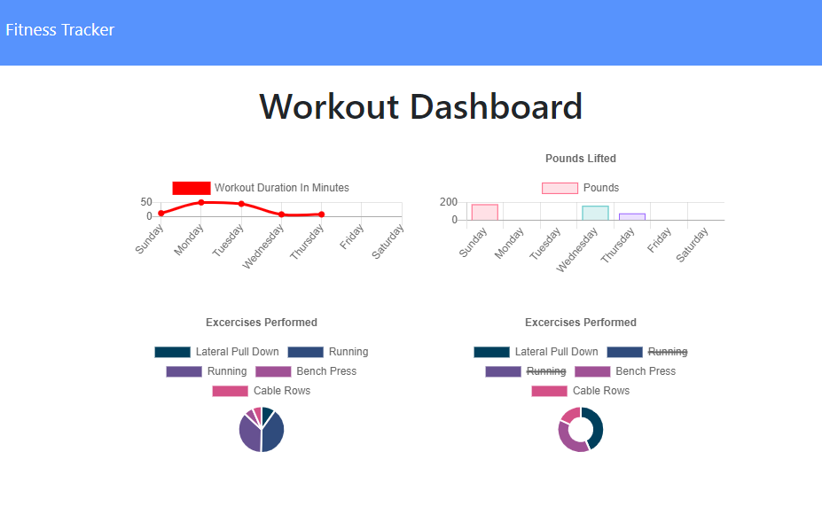

  # Training-Tracker

  

  ## Table of Contents

   * [Description](#description) 

   * [Installation](#installation) 

   * [Usage](#usage) 

   * [Contributing](#contributing) 

   * [License](#license) 

   * [Questions](#questions) 

  ## Description:
  

  This app allows users to keep track of their training and exercise. Users will be able to start a workout and log the exercises that they do through their routine, when the user finishes their workout their activity will be saved. Navigate to the fitness dashboard to see your activity throughout the week. This app is intended for users to be able to keep track of their regimen and for them to try and be consistent with their exercise. Training Tracker aims to help others to stay healthy and aid them in their fitness journey by logging their agenda.
  ## Installation: 
  To install: Fork the repository for your own use. If you would like to contribute to the project, clone the repo and follow the steps in the "Contributing" section below.
  ## Usage:
  To use the app simply navigate through the homepage. Select whether you want to continue your workout from a session you started previously, or start a new workout to log for a new day. 
  
  
  Once you have made your selection you will be able to add exercises to your workout and log what you have done or what you plan to do. Choose whether your exercise is categorized in "Resistance" (i.e weights, push, pull, etc.) or "Cardio" (i.e running, sprinting, jumping, etc.) then input the name of your exercise and the duration at which you plan to perform it. Click "Add Exercise" to log your performance in the dashboard. Continue to add exercises as your routine sees fit. Click "Complete" to end your session and mark the end of your workout. 
  
  
  Navigate to the dashboard to see your fitness performance throughout the week.
  ## Contributing: 
  No contributors as of yet. 
  If you would like to contribute, clone the repo into your local machine. Navigate to the directory of the project on your local machine and create a new branch using the 'git' command:
  
    'git checkout -b <your branch name>
  
  and add features that you want to see in the project. Then commit your changes and create a pull request with a brief statement/overview of your new feature.
  ## License:  

  This project is protected under the [MIT](https://opensource.org/licenses/MIT) license. Use is encouraged as outlined in this license.

  ## Questions: 
  For questions about the project go to my GitHub page at:

  * [GitHub Profile](https://github.com/Nardacyon)
